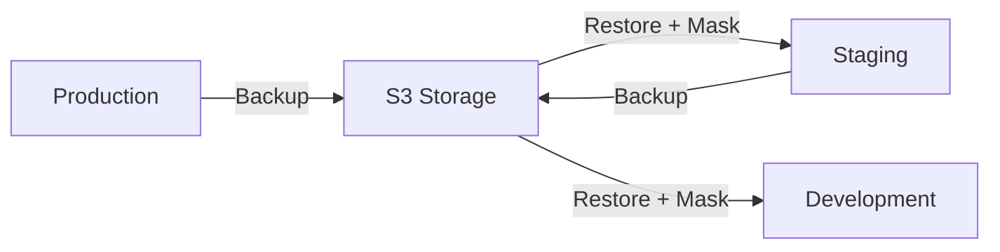

# Practical Scenarios Guide

Complete examples for real-world backup and restore workflows.

## Table of Contents
1. [Backup Production → Restore to New Local Container](#scenario-1-backup-production--restore-to-new-local-container)
2. [Select Specific Backup → Apply to Dev Server](#scenario-2-select-specific-backup--apply-to-dev-server)
3. [K3s Namespace Management](#scenario-3-k3s-namespace-management)
4. [Cross-Environment Workflows](#scenario-4-cross-environment-workflows)
5. [Advanced Scenarios](#scenario-5-advanced-scenarios)

---

## Scenario 1: Backup Production → Restore to New Local Container

### Use Case
You want to take a backup from your production server and deploy a new Docker container on your local machine with that production data for testing.

### Step-by-Step Workflow

#### Step 1: Register Production Server

**Via UI:**
1. Go to **Servers → Add Server**
2. Configure production server:
```
Name: Production DB Server
Type: docker
Environment: production
Host: prod-server.example.com
Port: 2375
Credentials:
  username: admin
  password: your-password
```

**Via API:**
```bash
curl -X POST http://localhost:8000/api/v1/servers \
  -H "Authorization: Bearer $TOKEN" \
  -H "Content-Type: application/json" \
  -d '{
    "name": "Production DB Server",
    "type": "docker",
    "environment": "production",
    "host": "prod-server.example.com",
    "port": 2375,
    "credentials": {
      "username": "admin",
      "password": "your-password"
    }
  }'
```

#### Step 2: Create Backup from Production

**Via UI:**
1. Go to **Backups → Create Backup**
2. Select:
   - Server: Production DB Server
   - Database: myapp_production
   - Database Type: PostgreSQL
   - Backup Type: Full
   - Compression: gzip
   - Encryption: Enabled

**Via API:**
```bash
curl -X POST http://localhost:8000/api/v1/backups \
  -H "Authorization: Bearer $TOKEN" \
  -H "Content-Type: application/json" \
  -d '{
    "server_id": 1,
    "database_name": "myapp_production",
    "db_type": "postgresql",
    "backup_type": "full",
    "compress": true,
    "encryption": true
  }'
```

**Monitor Progress:**
- Real-time progress bar shows: Creating → Compressing → Encrypting → Uploading
- WebSocket updates in Log Viewer (bottom-right terminal icon)
- Notification when complete

#### Step 3: Register Your Local Docker Host

**Via UI:**
```
Name: Local Docker
Type: docker
Environment: development
Host: localhost
Port: 2375 (or use unix:///var/run/docker.sock)
Credentials:
  username: local
  password: local
```

**Via API:**
```bash
curl -X POST http://localhost:8000/api/v1/servers \
  -H "Authorization: Bearer $TOKEN" \
  -H "Content-Type: application/json" \
  -d '{
    "name": "Local Docker",
    "type": "docker",
    "environment": "development",
    "host": "localhost",
    "port": 2375,
    "credentials": {
      "username": "local",
      "password": "local"
    }
  }'
```

#### Step 4: Create New Container Locally

**Option A: Create container manually, then restore**
```bash
# On your local machine
docker run -d \
  --name myapp_local \
  -e POSTGRES_PASSWORD=local123 \
  -p 5433:5432 \
  postgres:15

# Create database
docker exec myapp_local psql -U postgres -c "CREATE DATABASE myapp_local;"
```

**Option B: Use the platform's container creation** (if implemented)
```bash
curl -X POST http://localhost:8000/api/v1/servers/2/containers \
  -H "Authorization: Bearer $TOKEN" \
  -d '{
    "name": "myapp_local",
    "image": "postgres:15",
    "environment": {
      "POSTGRES_PASSWORD": "local123"
    },
    "ports": {"5432": "5433"}
  }'
```

#### Step 5: Restore Production Backup to Local Container

**Via UI:**
1. Go to **Backups**
2. Find your production backup (e.g., "backup_myapp_production_2024-01-15...")
3. Click **Restore**
4. Configure:
   ```
   Target Server: Local Docker
   Target Database: myapp_local
   Container: myapp_local

   Data Masking: ✓ Enabled (mask sensitive production data)
   Masking Rules:
     users.email → email
     users.phone → phone
     payments.credit_card → credit_card
   ```
5. Click **Start Restore**

**Via API:**
```bash
# Get backup ID first
BACKUP_ID=123

curl -X POST http://localhost:8000/api/v1/backups/$BACKUP_ID/restore \
  -H "Authorization: Bearer $TOKEN" \
  -H "Content-Type: application/json" \
  -d '{
    "target_server_id": 2,
    "target_database": "myapp_local",
    "mask_data": true,
    "masking_rules": {
      "users.email": "email",
      "users.phone": "phone",
      "payments.credit_card": "credit_card"
    }
  }'
```

**Monitor Restore:**
- Real-time progress: Downloading → Decrypting → Decompressing → Restoring → Masking
- Log viewer shows each step
- Notification on completion

#### Step 6: Verify Local Container

```bash
# Connect to your local container
docker exec -it myapp_local psql -U postgres -d myapp_local

# Check data
SELECT COUNT(*) FROM users;
SELECT email FROM users LIMIT 5;  -- Should show masked emails like abc123@example.com
```

### Complete Automated Script

```bash
#!/bin/bash
# backup-prod-to-local.sh

TOKEN="your-jwt-token"
API="http://localhost:8000/api/v1"

# 1. Create backup from production
echo "Creating production backup..."
BACKUP_ID=$(curl -s -X POST $API/backups \
  -H "Authorization: Bearer $TOKEN" \
  -H "Content-Type: application/json" \
  -d '{
    "server_id": 1,
    "database_name": "myapp_production",
    "db_type": "postgresql",
    "backup_type": "full",
    "compress": true,
    "encryption": true
  }' | jq -r '.id')

echo "Backup ID: $BACKUP_ID"

# 2. Wait for backup to complete
while true; do
  STATUS=$(curl -s $API/backups/$BACKUP_ID \
    -H "Authorization: Bearer $TOKEN" | jq -r '.status')

  echo "Backup status: $STATUS"

  if [ "$STATUS" = "completed" ]; then
    break
  elif [ "$STATUS" = "failed" ]; then
    echo "Backup failed!"
    exit 1
  fi

  sleep 5
done

# 3. Create local container
echo "Creating local container..."
docker run -d \
  --name myapp_local_$(date +%Y%m%d) \
  -e POSTGRES_PASSWORD=local123 \
  -p 5433:5432 \
  postgres:15

sleep 5

docker exec myapp_local_$(date +%Y%m%d) \
  psql -U postgres -c "CREATE DATABASE myapp_local;"

# 4. Restore to local
echo "Restoring to local container..."
curl -X POST $API/backups/$BACKUP_ID/restore \
  -H "Authorization: Bearer $TOKEN" \
  -H "Content-Type: application/json" \
  -d '{
    "target_server_id": 2,
    "target_database": "myapp_local",
    "mask_data": true,
    "masking_rules": {
      "users.email": "email",
      "users.phone": "phone"
    }
  }'

echo "Done! Local container ready at localhost:5433"
```

---

## Scenario 2: Select Specific Backup → Apply to Dev Server

### Use Case
Browse available backups, select a specific one from last week, and apply it to your dev server.

### Step-by-Step Workflow

#### Step 1: List Available Backups

**Via UI:**
1. Go to **Backups**
2. Filter by:
   - Server: Production DB Server
   - Database: myapp_production
   - Date range: Last 7 days
3. Sort by: Date (newest first)

**Via API:**
```bash
# List all backups
curl -X GET "http://localhost:8000/api/v1/backups?server_id=1&limit=50" \
  -H "Authorization: Bearer $TOKEN"

# Filter by date
curl -X GET "http://localhost:8000/api/v1/backups?server_id=1&start_date=2024-01-08&end_date=2024-01-15" \
  -H "Authorization: Bearer $TOKEN"
```

**Response:**
```json
{
  "total": 248,
  "items": [
    {
      "id": 145,
      "database_name": "myapp_production",
      "backup_type": "full",
      "status": "completed",
      "size_bytes": 2147483648,
      "created_at": "2024-01-14T02:00:00Z",
      "storage_path": "s3://backups/2024/01/14/backup_145.dat"
    },
    {
      "id": 144,
      "database_name": "myapp_production",
      "backup_type": "full",
      "status": "completed",
      "size_bytes": 2100000000,
      "created_at": "2024-01-13T02:00:00Z",
      "storage_path": "s3://backups/2024/01/13/backup_144.dat"
    }
  ]
}
```

#### Step 2: Select Specific Backup

**Via UI:**
1. Click on backup row to see details:
   ```
   Backup ID: 144
   Database: myapp_production
   Type: Full
   Created: Jan 13, 2024 02:00 AM
   Size: 2.0 GB
   Status: Completed
   Checksum: sha256:abc123...
   ```
2. Click **Restore** button

**Via API:**
```bash
# Get specific backup details
curl -X GET http://localhost:8000/api/v1/backups/144 \
  -H "Authorization: Bearer $TOKEN"
```

#### Step 3: Configure Dev Server

**Register dev server** (if not already registered):
```bash
curl -X POST http://localhost:8000/api/v1/servers \
  -H "Authorization: Bearer $TOKEN" \
  -H "Content-Type: application/json" \
  -d '{
    "name": "Dev Server",
    "type": "docker",
    "environment": "development",
    "host": "dev.example.com",
    "port": 2375,
    "credentials": {
      "username": "dev",
      "password": "dev-password"
    }
  }'
```

#### Step 4: Apply Backup to Dev Server

**Via UI:**
1. In backup details, click **Restore**
2. Configure:
   ```
   Target Server: Dev Server
   Target Database: myapp_dev

   Options:
   ✓ Enable data masking
   ✓ Drop existing data
   ✓ Verify after restore

   Masking Rules:
     users.email → email
     users.password → hash
     api_keys.key → randomize
   ```
3. Click **Start Restore**
4. Watch real-time progress in log viewer

**Via API:**
```bash
curl -X POST http://localhost:8000/api/v1/backups/144/restore \
  -H "Authorization: Bearer $TOKEN" \
  -H "Content-Type: application/json" \
  -d '{
    "target_server_id": 3,
    "target_database": "myapp_dev",
    "mask_data": true,
    "masking_rules": {
      "users.email": "email",
      "users.password": "hash",
      "api_keys.key": "randomize"
    }
  }'
```

#### Step 5: Verify Restore

**Via UI:**
1. Go to **Backups → Restore History**
2. Find your restore operation
3. Check status: Completed ✓
4. View logs and timing

**Via API:**
```bash
# Check restore status
curl -X GET http://localhost:8000/api/v1/backups/144/restores \
  -H "Authorization: Bearer $TOKEN"
```

**Verify on dev server:**
```bash
# SSH to dev server
ssh dev.example.com

# Check database
docker exec dev-db psql -U postgres -d myapp_dev -c "SELECT COUNT(*) FROM users;"
docker exec dev-db psql -U postgres -d myapp_dev -c "SELECT email FROM users LIMIT 5;"
```

### Using Python SDK (Optional)

```python
#!/usr/bin/env python3
from dbbackup import BackupClient

# Initialize client
client = BackupClient(
    api_url="http://localhost:8000",
    token="your-jwt-token"
)

# List backups from last week
backups = client.backups.list(
    server_id=1,
    start_date="2024-01-08",
    end_date="2024-01-15",
    status="completed"
)

# Select specific backup (e.g., from Jan 13)
backup = next(b for b in backups if b.created_at.day == 13)
print(f"Selected backup: {backup.id} ({backup.size_mb} MB)")

# Restore to dev server
restore = client.backups.restore(
    backup_id=backup.id,
    target_server_id=3,
    target_database="myapp_dev",
    mask_data=True,
    masking_rules={
        "users.email": "email",
        "users.password": "hash"
    }
)

# Wait for completion
restore.wait_for_completion(timeout=3600)
print(f"Restore completed: {restore.status}")
```

---

## Scenario 3: K3s Namespace Management

### Use Case
Manage backups across different K3s namespaces (production, staging, development).

### K3s Architecture

```
K3s Cluster
├── namespace: production
│   ├── pod: postgres-prod-0
│   └── service: postgres-prod
├── namespace: staging
│   ├── pod: postgres-staging-0
│   └── service: postgres-staging
└── namespace: development
    ├── pod: postgres-dev-0
    └── service: postgres-dev
```

### Step 1: Register K3s Cluster with Namespace Support

**Get kubeconfig from K3s:**
```bash
# On K3s master node
sudo cat /etc/rancher/k3s/k3s.yaml > k3s-config.yaml

# Replace 127.0.0.1 with actual server IP
sed -i 's/127.0.0.1/k3s.example.com/g' k3s-config.yaml
```

**Register cluster via UI:**
1. Go to **Servers → Add Server**
2. Configure:
   ```
   Name: K3s Production Cluster
   Type: kubernetes
   Environment: production
   Host: k3s.example.com
   Port: 6443

   Credentials:
     kubeconfig: <<< paste k3s-config.yaml content >>>
     default_namespace: production
   ```

**Register cluster via API:**
```bash
curl -X POST http://localhost:8000/api/v1/servers \
  -H "Authorization: Bearer $TOKEN" \
  -H "Content-Type: application/json" \
  -d '{
    "name": "K3s Production Cluster",
    "type": "kubernetes",
    "environment": "production",
    "host": "k3s.example.com",
    "port": 6443,
    "credentials": {
      "kubeconfig": "'$(cat k3s-config.yaml | base64)'",
      "default_namespace": "production"
    }
  }'
```

### Step 2: Backup from Production Namespace

**Discover databases in namespace:**
```bash
# Via API
curl -X GET "http://localhost:8000/api/v1/servers/4/namespaces/production/databases" \
  -H "Authorization: Bearer $TOKEN"
```

**Response:**
```json
{
  "namespace": "production",
  "pods": [
    {
      "name": "postgres-prod-0",
      "containers": ["postgres"],
      "status": "Running"
    }
  ],
  "databases": [
    "myapp_production",
    "analytics_production"
  ]
}
```

**Create backup:**
```bash
curl -X POST http://localhost:8000/api/v1/backups \
  -H "Authorization: Bearer $TOKEN" \
  -H "Content-Type: application/json" \
  -d '{
    "server_id": 4,
    "namespace": "production",
    "pod_name": "postgres-prod-0",
    "container": "postgres",
    "database_name": "myapp_production",
    "db_type": "postgresql",
    "backup_type": "full",
    "compress": true,
    "encryption": true
  }'
```

**The platform executes:**
```bash
# Platform runs this internally
kubectl exec -n production postgres-prod-0 -c postgres -- \
  pg_dump -U postgres myapp_production -Fc > backup.dump
```

### Step 3: Restore to Different Namespace

**Scenario: Restore production backup to staging namespace**

**Via UI:**
1. Go to **Backups**
2. Select production backup
3. Click **Restore**
4. Configure:
   ```
   Target Server: K3s Production Cluster (same cluster)
   Target Namespace: staging
   Target Pod: postgres-staging-0
   Target Database: myapp_staging

   Data Masking: ✓ Enabled
   ```

**Via API:**
```bash
curl -X POST http://localhost:8000/api/v1/backups/150/restore \
  -H "Authorization: Bearer $TOKEN" \
  -H "Content-Type: application/json" \
  -d '{
    "target_server_id": 4,
    "target_namespace": "staging",
    "target_pod": "postgres-staging-0",
    "target_container": "postgres",
    "target_database": "myapp_staging",
    "mask_data": true,
    "masking_rules": {
      "users.email": "email",
      "users.phone": "phone"
    }
  }'
```

**The platform executes:**
```bash
# Download backup from S3
# Decrypt and decompress
# Then:
kubectl exec -n staging postgres-staging-0 -c postgres -- \
  pg_restore -U postgres -d myapp_staging --clean < backup.dump
```

### Step 4: Cross-Namespace Backup Schedule

**Create schedule for each namespace:**

**Production (daily full backup):**
```bash
curl -X POST http://localhost:8000/api/v1/schedules \
  -H "Authorization: Bearer $TOKEN" \
  -H "Content-Type: application/json" \
  -d '{
    "name": "Production Daily Backup",
    "server_id": 4,
    "namespace": "production",
    "pod_name": "postgres-prod-0",
    "database_name": "myapp_production",
    "cron_expression": "0 2 * * *",
    "backup_type": "full",
    "retention_policy_id": 1,
    "enabled": true
  }'
```

**Staging (weekly backup):**
```bash
curl -X POST http://localhost:8000/api/v1/schedules \
  -H "Authorization: Bearer $TOKEN" \
  -H "Content-Type: application/json" \
  -d '{
    "name": "Staging Weekly Backup",
    "server_id": 4,
    "namespace": "staging",
    "pod_name": "postgres-staging-0",
    "database_name": "myapp_staging",
    "cron_expression": "0 3 * * 0",
    "backup_type": "full",
    "retention_policy_id": 2,
    "enabled": true
  }'
```

### Step 5: Namespace-Specific Views

**Via UI - Dashboard shows:**
```
┌─────────────────────────────────────────┐
│ K3s Production Cluster                  │
├─────────────────────────────────────────┤
│ Namespace: production                   │
│   Pods: 3                               │
│   Last Backup: 2 hours ago              │
│   Status: Healthy ✓                     │
├─────────────────────────────────────────┤
│ Namespace: staging                      │
│   Pods: 2                               │
│   Last Backup: 1 day ago                │
│   Status: Healthy ✓                     │
├─────────────────────────────────────────┤
│ Namespace: development                  │
│   Pods: 1                               │
│   Last Backup: Never                    │
│   Status: Healthy ✓                     │
└─────────────────────────────────────────┘
```

### Advanced: Multi-Cluster Multi-Namespace

**Register multiple K3s clusters:**

1. **Production Cluster** (k3s-prod)
   - namespace: production
   - namespace: monitoring

2. **Staging Cluster** (k3s-staging)
   - namespace: staging
   - namespace: testing

3. **Dev Cluster** (k3s-dev)
   - namespace: development
   - namespace: experimental

**Cross-cluster restore:**
```bash
# Backup from prod cluster → Restore to staging cluster
curl -X POST http://localhost:8000/api/v1/backups/160/restore \
  -H "Authorization: Bearer $TOKEN" \
  -H "Content-Type: application/json" \
  -d '{
    "target_server_id": 5,
    "target_namespace": "staging",
    "target_pod": "postgres-0",
    "target_database": "myapp_staging",
    "mask_data": true
  }'
```

---

## Scenario 4: Cross-Environment Workflows

### Complete Production → Staging → Development Flow



**Automated daily workflow:**

```python
#!/usr/bin/env python3
"""
Daily workflow: Sync production to staging with masking
"""
import requests
import time

API = "http://localhost:8000/api/v1"
TOKEN = "your-jwt-token"
headers = {"Authorization": f"Bearer {TOKEN}"}

def create_backup(server_id, database):
    """Create production backup"""
    resp = requests.post(f"{API}/backups", headers=headers, json={
        "server_id": server_id,
        "database_name": database,
        "db_type": "postgresql",
        "backup_type": "full",
        "compress": True,
        "encryption": True
    })
    return resp.json()["id"]

def wait_for_backup(backup_id):
    """Wait for backup completion"""
    while True:
        resp = requests.get(f"{API}/backups/{backup_id}", headers=headers)
        status = resp.json()["status"]
        if status == "completed":
            return True
        elif status == "failed":
            return False
        time.sleep(10)

def restore_to_staging(backup_id, target_server_id):
    """Restore to staging with masking"""
    resp = requests.post(f"{API}/backups/{backup_id}/restore", headers=headers, json={
        "target_server_id": target_server_id,
        "target_database": "myapp_staging",
        "mask_data": True,
        "masking_rules": {
            "users.email": "email",
            "users.phone": "phone",
            "users.ssn": "null",
            "payments.credit_card": "credit_card"
        }
    })
    return resp.json()

# Execute workflow
print("Starting production → staging sync...")

# 1. Backup production
backup_id = create_backup(server_id=1, database="myapp_production")
print(f"Created backup: {backup_id}")

# 2. Wait for completion
if wait_for_backup(backup_id):
    print("Backup completed")

    # 3. Restore to staging
    restore_to_staging(backup_id, target_server_id=3)
    print("Restore to staging initiated")
else:
    print("Backup failed!")
```

---

## Scenario 5: Advanced Scenarios

### 5.1: Point-in-Time Recovery

**Incremental backup chain:**
```
Full Backup (Sunday)
  ↓
Incremental (Monday)
  ↓
Incremental (Tuesday) ← Restore to this point
  ↓
Incremental (Wednesday)
```

**Platform automatically:**
1. Identifies required backup chain
2. Downloads: Full + Monday + Tuesday incrementals
3. Restores in correct order

### 5.2: Multi-Database Backup

**Backup all databases on a server:**
```bash
# Get all databases
DATABASES=$(curl -s "$API/servers/1/databases" -H "Authorization: Bearer $TOKEN" | jq -r '.databases[].name')

# Backup each
for db in $DATABASES; do
  curl -X POST "$API/backups" -H "Authorization: Bearer $TOKEN" -d "{
    \"server_id\": 1,
    \"database_name\": \"$db\",
    \"db_type\": \"postgresql\",
    \"backup_type\": \"full\"
  }"
done
```

### 5.3: Disaster Recovery

**Complete environment rebuild:**
```bash
# 1. List all backups from production
curl "$API/backups?environment=production&status=completed" \
  -H "Authorization: Bearer $TOKEN" > prod_backups.json

# 2. Get latest backup for each database
jq -r 'group_by(.database_name) | map(max_by(.created_at)) | .[]' prod_backups.json

# 3. Restore each to new environment
# (Automated via platform UI or script)
```

---

## Quick Reference

### Common Commands

**List backups:**
```bash
curl "$API/backups?server_id=1&limit=10" -H "Authorization: Bearer $TOKEN"
```

**Create backup:**
```bash
curl -X POST "$API/backups" -H "Authorization: Bearer $TOKEN" -d '{"server_id":1,"database_name":"mydb","db_type":"postgresql","backup_type":"full"}'
```

**Restore backup:**
```bash
curl -X POST "$API/backups/123/restore" -H "Authorization: Bearer $TOKEN" -d '{"target_server_id":2,"target_database":"mydb_dev","mask_data":true}'
```

**Check restore status:**
```bash
curl "$API/backups/123/restores" -H "Authorization: Bearer $TOKEN"
```

---

All these scenarios are **fully supported** by the platform right now! 🚀
